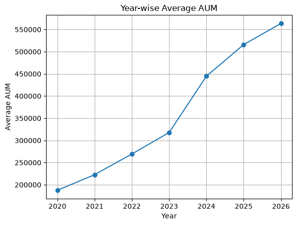
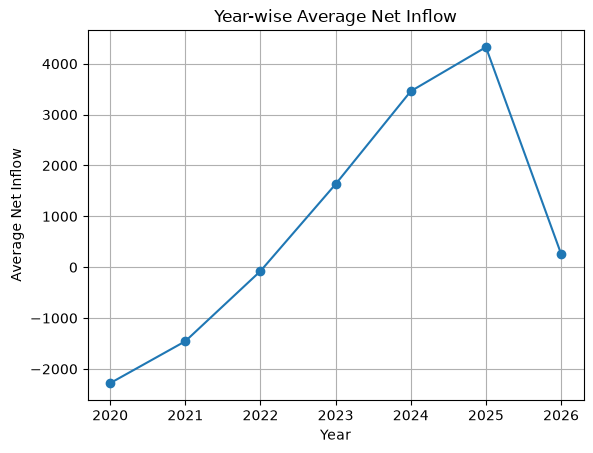
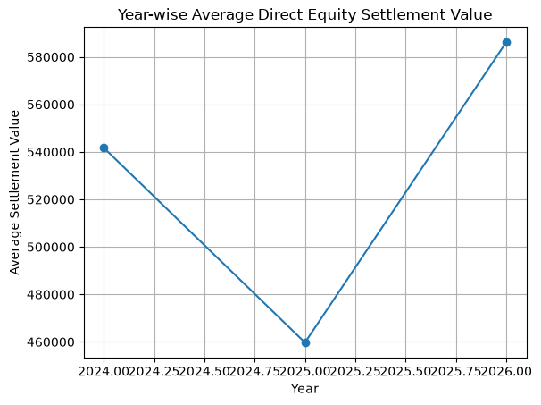
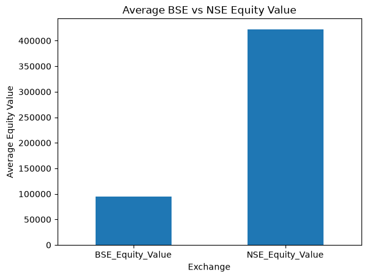
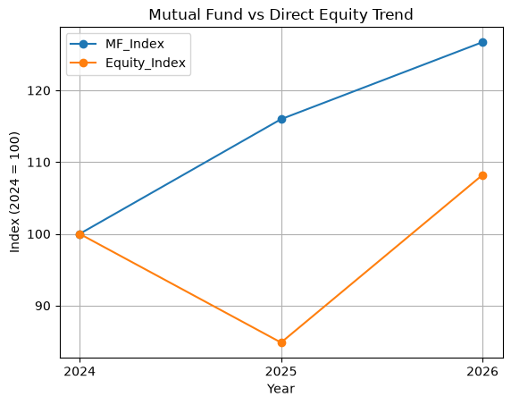
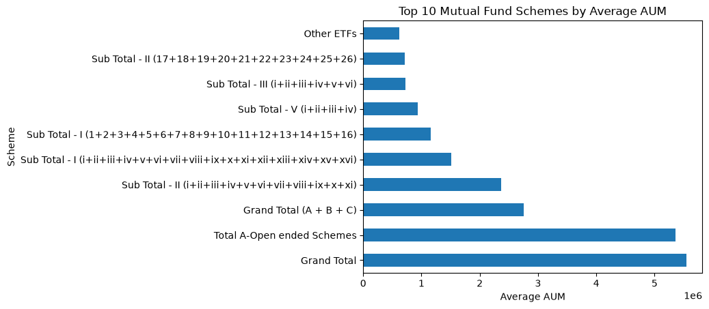
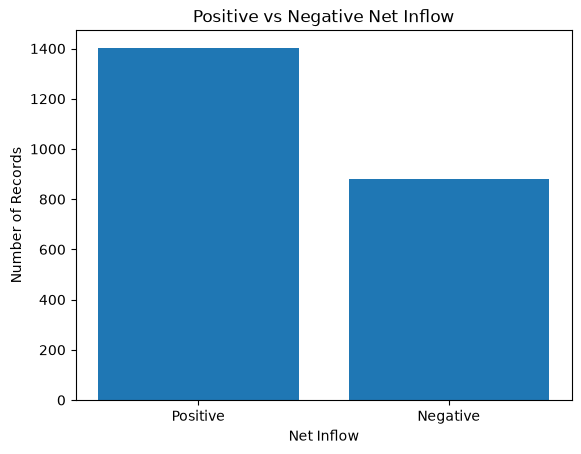

# 📊 Mutual Fund vs Direct Equity Investment Trend Analysis

### 📈 Financial Data Analytics Project using Python, SQL, MySQL & Power BI

A financial data analytics project that analyzes and compares **Mutual Fund** and **Direct Equity** investment trends using financial market data.

This project follows an end-to-end data analytics workflow including **data collection, data cleaning, MySQL database management, SQL analysis, Python-based EDA, data visualization, Power BI dashboard development, and automated PDF reporting.**

---

## 🎯 Project Objective

The main objective of this project is to analyze and compare investment trends in **Mutual Funds** and **Direct Equity** using financial data and data analytics tools.

### Key Objectives

- Analyze Mutual Fund Assets Under Management (AUM)
- Analyze Mutual Fund Net Inflow
- Study Mutual Fund Folio trends
- Analyze Direct Equity Settlement Value
- Compare BSE and NSE Equity Values
- Compare Mutual Fund and Direct Equity trends
- Identify top Mutual Fund schemes based on average AUM
- Build an interactive Power BI dashboard
- Generate an automated analytical PDF report

---

# 🛠️ Technologies & Tools

<p align="center">


</p>

### Main Tools Used

- 🐍 **Python** – Data analysis and automation
- 🐼 **Pandas** – Data cleaning and analysis
- 🔢 **NumPy** – Numerical operations
- 📊 **Matplotlib** – Data visualization
- 🗄️ **MySQL** – Database storage
- 🔎 **SQL** – Data querying and analysis
- 📈 **Power BI** – Interactive dashboard
- 📓 **Jupyter Notebook** – Exploratory Data Analysis
- 📄 **ReportLab** – Automated PDF report generation
- 🔧 **Git & GitHub** – Version control and project hosting

---

# 📂 Data Sources

## 💼 Mutual Fund Data

The Mutual Fund data is based on **AMFI – Association of Mutual Funds in India** data.

The dataset contains information related to:

- Assets Under Management (AUM)
- Net Inflow
- Number of Folios
- Mutual Fund Schemes
- Year-wise data
- Month-wise data

## 📈 Direct Equity Data

The Direct Equity dataset contains market-related information including:

- BSE Equity Value
- NSE Equity Value
- Total Equity Settlement Value
- Year-wise data
- Month-wise data

> **Note:** Demat account counts should not be considered the same as unique investor counts because one investor can hold multiple demat accounts.

---

# 🔄 Project Workflow

```text
📥 Data Collection
        ↓
🧹 Data Cleaning
        ↓
🗄️ MySQL Database
        ↓
🔎 SQL Queries & Analysis
        ↓
🐍 Python + Pandas
        ↓
📊 Exploratory Data Analysis
        ↓
📈 Matplotlib Visualizations
        ↓
📊 Power BI Dashboard
        ↓
📄 Automated PDF Report
        ↓
💡 Insights & Conclusion
```

---

# 🔍 Exploratory Data Analysis

The Jupyter Notebook performs basic and business-focused Exploratory Data Analysis.

### Analysis Performed

- Dataset structure and information
- Missing value analysis
- Duplicate record detection
- Data cleaning
- Statistical summary
- Year-wise Average AUM
- Year-wise Average Net Inflow
- Month-wise Average AUM
- Year-wise Direct Equity analysis
- BSE vs NSE comparison
- Mutual Fund vs Direct Equity trend comparison
- Top 10 Mutual Fund schemes by average AUM
- Positive vs Negative Net Inflow analysis

---

# 📊 Data Visualizations

The following visualizations were created using **Python and Matplotlib**.

---

## 1️⃣ Year-wise Average AUM

This chart shows the yearly trend of average Mutual Fund Assets Under Management.

<p align="center">



</p>

---

## 2️⃣ Year-wise Average Net Inflow

This visualization shows the yearly average Mutual Fund Net Inflow.

<p align="center">



</p>

---

## 3️⃣ Year-wise Direct Equity Trend

This chart shows the yearly average Direct Equity Settlement Value.

<p align="center">



</p>

---

## 4️⃣ BSE vs NSE Equity Value

This visualization compares the average equity value of BSE and NSE.

<p align="center">



</p>

---

## 5️⃣ Mutual Fund vs Direct Equity Trend

This chart compares the indexed trend of Mutual Fund AUM and Direct Equity Value.

**Base Year: 2024 = 100**

<p align="center">



</p>

---

## 6️⃣ Top 10 Mutual Fund Schemes by Average AUM

This chart presents the top 10 Mutual Fund schemes based on average AUM.

<p align="center">



</p>

---

## 7️⃣ Positive vs Negative Net Inflow

This visualization compares the number of records having positive and negative Net Inflow.

<p align="center">



</p>

---

# 📊 Power BI Dashboard

The Power BI dashboard provides an interactive view of the major financial indicators and trends.

### Dashboard Includes

- 💰 Total AUM
- 💵 Average Net Inflow
- 📈 Average Direct Equity Value
- 📋 Total Records
- 📊 Mutual Fund vs Direct Equity Trend
- 📈 Mutual Fund Net Inflow Trend
- 🏦 BSE vs NSE Equity Value Trend
- 🥧 BSE vs NSE Equity Value Share
- 👥 Mutual Fund Folio Trend

---

# 🖥️ Power BI Dashboard Preview

<p align="center">


</p>

---

# 🗄️ SQL & Database Analysis

MySQL is used for storing and querying the financial datasets.

### SQL Analysis Includes

- Table creation
- Data extraction
- Filtering
- Aggregation
- `GROUP BY` analysis
- Joins
- Year-wise analysis
- Financial trend analysis

---

# 🐍 Python Analysis

Python is used throughout the project for:

- Database connection
- Data loading
- Data cleaning
- Exploratory Data Analysis
- Numerical analysis
- Data visualization
- Automated report generation

### Python Libraries

```text
Pandas
NumPy
Matplotlib
mysql-connector-python
python-dotenv
ReportLab
```

---

# 📄 Automated PDF Report

An automated PDF report is generated using **Python and ReportLab**.

### Report Contains

- Mutual Fund analysis
- Direct Equity analysis
- BSE vs NSE comparison
- Net Inflow analysis
- Top Mutual Fund schemes
- Trend visualizations
- Key observations
- Conclusion

---

# 📚 Research Papers

## 📄 Paper 1

### Mutual Fund vs Direct Equity Investment Trend Analysis in India

This paper focuses on the comparison of Mutual Fund and Direct Equity investment trends in India.

---

## 📄 Paper 2

### Role of Python, SQL and Power BI in Financial Data Analytics

This paper focuses on the role of Python, SQL and Power BI in financial data analytics.

---

# 📁 Project Structure

```text
Mutual_Fund_Vs_Direct_Equity_Analysis/
│
├── 📂 data/
│   ├── combined_mutual_fund_data.csv
│   └── direct_equity/
│       └── direct_equity_monthly_data.csv
│
├── 📂 notebooks/
│   └── 01_AMFI_Mutual_Fund_Analysis.ipynb
│
├── 📂 src/
│   ├── 02_Database_Connection.py
│   ├── Report_Generation.py
│   └── Mutual_Fund_Direct_Equity_Report.pdf
│
├── 📂 sql/
│   └── Mutual_fund_Vs_Diect_Equity_Analysis.sql
│
├── 📂 papers/
│   ├── Mutual_Fund_vs_Direct_Equity_Research_Paper.pdf
│   └── Role_of_Python_SQL_and_Power_BI.pdf
│
├── 📂 powerbi/
│   ├── 04_Mutual_Fund_Vs_Direct_Equity_Dashboard.pbix
│   ├── Mutual Fund vs Direct Equity Dashboard.PNG
│   ├── aum_chart.png
│   ├── net_inflow_chart.png
│   ├── direct_equity_chart.png
│   ├── bse_nse_chart.png
│   ├── comparison_chart.png
│   ├── top_schemes_chart.png
│   └── positive_negative_chart.png
│
├── 📄 requirements.txt
├── 📄 README.md
└── 📄 .gitignore
```

---

# 📦 Project Deliverables

| 📌 Deliverable | 📝 Description |
|---|---|
| 📓 Jupyter Notebook | Exploratory Data Analysis and financial analysis |
| 🐍 Python Script | MySQL database connection |
| 🗄️ SQL File | Database creation and analytical queries |
| 📊 Power BI Dashboard | Interactive financial dashboard |
| 📄 Research Paper 1 | Domain-focused research paper |
| 📄 Research Paper 2 | Technology-focused research paper |
| 📑 PDF Report | Automated analytical report |
| 🖼️ Dashboard Screenshot | Power BI dashboard preview |

---

# 💡 Key Analysis Areas

The project focuses on understanding:

- 📈 Mutual Fund investment trends
- 📊 Direct Equity market trends
- 💰 AUM movement
- 💵 Net Inflow patterns
- 👥 Folio trends
- 🏦 BSE and NSE activity
- 📋 Scheme-level AUM
- 🔄 Mutual Fund vs Direct Equity trend movement

---

# 🚀 Key Outcome

This project demonstrates an end-to-end **Financial Data Analytics workflow**:

```text
SQL
  ↓
MySQL
  ↓
Python
  ↓
Pandas
  ↓
EDA
  ↓
Matplotlib
  ↓
Power BI
  ↓
Business Insights
```

The project demonstrates how raw financial data can be transformed into structured analysis, meaningful visualizations, interactive dashboards, and analytical reports.

---

# 👩‍💻 Author

### Isha Jadhav

---

## ⭐ Project Highlights

- ✅ End-to-end Data Analytics Project
- ✅ Real-world Financial Data
- ✅ Python-based EDA
- ✅ SQL & MySQL Database Analysis
- ✅ Interactive Power BI Dashboard
- ✅ Automated PDF Report
- ✅ Research Papers
- ✅ GitHub Version Control

---
